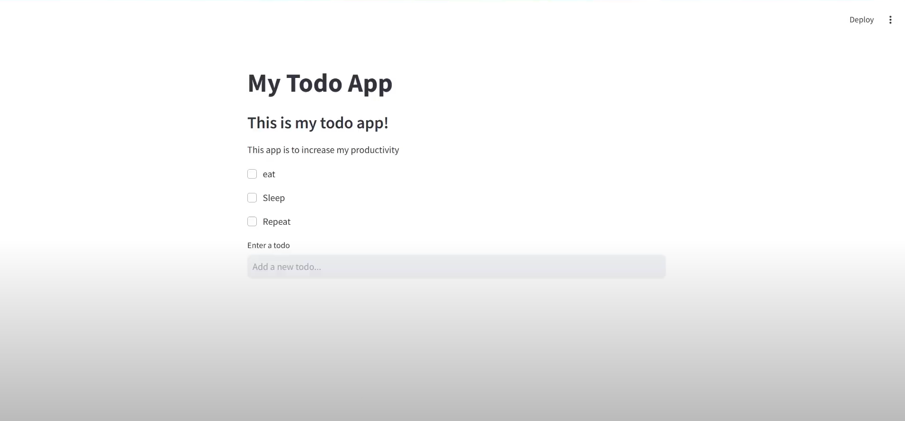
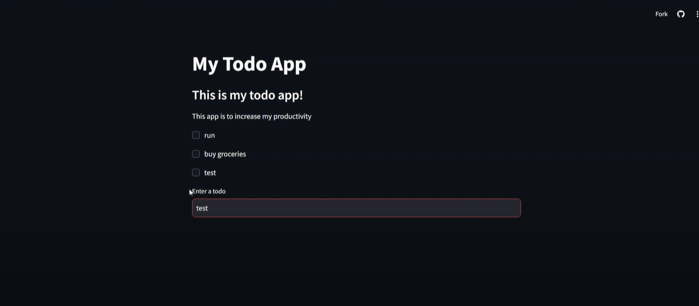

# 🌐 To-Do List Web App

Welcome to the **To-Do List Web App**, a modern, browser-based task management tool built with Python and Streamlit! This web app helps you stay productive and organized, and it's accessible from anywhere. 🌟

---

## 🎯 Features

### Core Features
- **Add Tasks**: Quickly add new tasks to your to-do list.
- **Complete Tasks**: Mark tasks as completed with a simple click.
- **Real-Time Updates**: Changes are instantly reflected in your list.
- **Persistent Storage**: Saves your tasks to a text file for future use.
- **Interactive UI**: Powered by Streamlit for a seamless user experience.

### Live App
- Experience the app live here: [To-Do List Web App](https://sathiyanarayanansk-todolistwebapp-python-web-ziowvm.streamlit.app/) 🚀

---

## 🚀 How It Works

### Adding Tasks
1. Type your new task in the input box.
2. Press **Enter** or click **Add** to save the task.

### Completing Tasks
1. Click the checkbox next to a task to mark it as completed.
2. The task will be removed from your list and saved automatically.

---

## 📂 Repository Structure
```
📂 todolist-webapp
├── app.py               # Streamlit-based To-Do Web App
├── functions.py         # Shared functions for handling tasks
├── todos.txt            # Text file to store tasks
├── README.md            # Project documentation
```

### Run Locally
To run the app locally:
```bash
streamlit run app.py
```

---

## 📸 Screenshots



---

## Demo Video
Click below to watch the demo video!

[](https://www.youtube.com/watch?v=ur_OfHDruyo)

---

## 📝 Notes
- Ensure that `todos.txt` exists in the project folder. The app will create the file if it doesn't exist.
- The live app is hosted on Streamlit Cloud for easy access.

---

## 🤝 Acknowledgments
Special thanks to the Streamlit community for their incredible tools and resources! 💖

---
## 📧 Contact
Feel free to explore the project and share your feedback. For any queries or suggestions, reach out to me at [sathiyanarayanan.s1698@gmail.com](mailto:sathiyanarayanan.s1698@gmail.com).